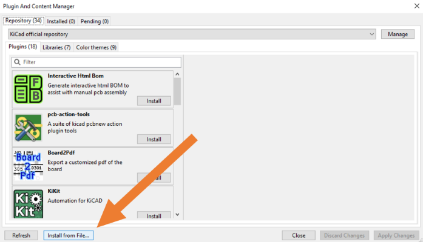

# Via Stitching

Via Stitching action-plugin for use with KiCad 9.0.  
Fills a selected copper area with a pattern of vias.

## Description

This plugin can fill copper areas with vias to improve thermal conduction, tie different layers together, or reduce resistance/inductance between layers.
The plugin relies on pre-existing areas, so you must define and select an area before starting the plugin.

## Installation

- Download the packaged version of this plugin: [ViaStitching.zip](https://nightly.link/narottamroyal/viastitching/workflows/package/master/ViaStitching.zip)
- Open the Plugin and Content Manager in KiCad 6
- Click `Install from File...` and select `ViaStitching.zip` to install the plugin
  

## Usage

- Select the area you want to fill
- Click on the  toolbar icon or select `Tools` → `External Plugins` → `ViaStitching`
- The following window should appear:


The plugin provides the following options:

- Net Name: allows you to change the net associated with the vias (defaults to the net associated with the target area)
- Via Pattern: allows you to select between grid and star via patterns
  - Grid: generates vias in a uniform grid (default)
  - Star: offsets every second row by half the grid spacing
- Via:
  - Size: sets the outer diameter of the vias (uses the current via size by default)
  - Drill: sets the drill/hole size of the vias (uses the current via size by default)
- Spacing:
  - X: sets the horizontal via spacing (defaults to double the via size)
  - Y: sets the vertical via spacing (defaults to double the via size)
- Offset (useful for aligning the via pattern by shifting all the vias):
  - X: offsets the via pattern from the left (0 by default)
  - Y: offsets the via pattern from the top (0 by default)
- Clearance:
  - Edge: sets the clearance from the edge of the target area (0 by default)  
    Note that a value of 0 disables clearance checking
  - Track: sets the clearance from all tracks (uses the largest clearance by default)
- Operations:
  - Fill: fills the target area with vias (default)
  - Clear: removes vias generated by this plugin (this is currently the best way to undo the via stitching)
    - Remove all vias: if checked, all vias associated with the target area will be removed

When you're satisfied with the settings, select **Ok** and the vias will be generated or removed (depending on whether **Fill** or **Clear** was selected).
If everything goes well, you should see something like this:


After stitching, it is always a good idea to run the DRC since some vias may overlap with other PCB elements or violate other design rules. It is currently up to the user to remove conflicting vias.
In future releases, the via generation process will prevent vias from overlapping with other elements.

## TODO

Some features still to code:

- [x] Match user units (mm/inches)
- [x] Add clear area function
- [x] Draw a better UI (if anyone is willing to contribute, please read the following section)
- [x] Collision between new vias and underlying objects:
  - [x] tracks
  - [x] zones
  - [x] pads
  - [x] modules
  - [x] vias
- [ ] Different fillup patterns/modes (bounding box, centered spiral)
- [x] Avoid placing vias near area edges (define clearance)
- [ ] History management (board commit)
- [ ] Localization
- [ ] Any other requests?

## Coding notes

If you are willing to modify the GUI (you're welcome) through **wxFormBuilder** (`viastitching.fbp` file) remember to modify this line (around line 25 `viastitching_gui.py`):

```
self.SetSizeHints( wx.DefaultSize, wx.DefaultSize )
```

In this way:

```
if sys.version_info[0] == 2:
 self.SetSizeHintsSz( wx.DefaultSize, wx.DefaultSize )
else:
 self.SetSizeHints( wx.DefaultSize, wx.DefaultSize )
```

This modification allows the code to work with **Python 2** as well as **Python 3**, please note that you need to `import sys`. Special thanks to _NilujePerchut_ for this hint.

## kicad-action-scripts - ViaStitching plugin similarity

Yes, this plugin is fairly similar to the kicad-action-scripts plugin, but the code for this plugin uses a different. At the time of writing, **jsreynaud**'s plugin isn't very functional for KiCad 6, but hopefully they will fix it!

## References

Some useful references that helped me coding this plugin:

1. https://github.com/wxFormBuilder/wxFormBuilder
2. https://wxpython.org/
3. https://docs.kicad.org/doxygen-python/namespacepcbnew.html
4. https://forum.kicad.info/c/external-plugins
5. https://kicad.mmccoo.com/
6. https://dev-docs.kicad.org/en/python/pcbnew/

Tool I got inspired by:

- Altium's via stitching feature
- https://github.com/jsreynaud/kicad-action-scripts

## Greetings

I hope someone finds my work useful or at least provides _inspiration_ to create something else/better.
I would like to thank everyone who has shared their knowledge of Python and KiCad with me: Thanks!

#

Live long and prosper!

That's all folks.

By[t]e{s}
Weirdgyn
